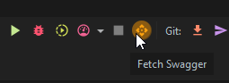
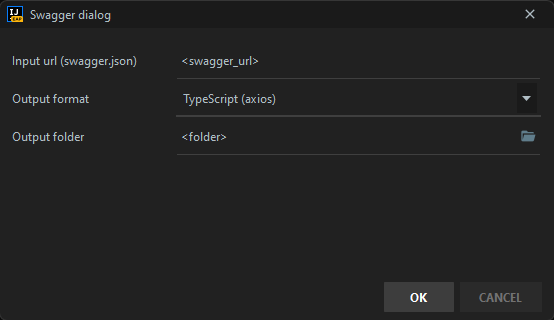
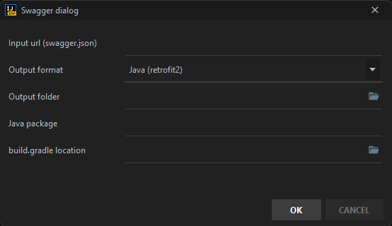

# jetbrains-swagger-import

<!-- Plugin description -->
This Fancy IntelliJ Platform Plugin allow you to generate swagger implementation from a swagger.json config

## Implementions available

- Typescript:
    - Fetch
    - Axios
    - Inversify
    - Generate Unit tests
- Java/Kotlin:
    - Retrofit2

<!-- Plugin description end -->

## Installation

- Using IDE built-in plugin system:

  <kbd>Preferences</kbd> > <kbd>Plugins</kbd> > <kbd>Marketplace</kbd> > <kbd>Search for "
  jetbrains-swagger-import"</kbd> >
  <kbd>Install Plugin</kbd>

- Manually:

  Download the [latest release](https://github.com/Elyspio/jetbrains-swagger-import/releases/latest) and install it manually using
  <kbd>Preferences</kbd> > <kbd>Plugins</kbd> > <kbd>⚙️</kbd> > <kbd>Install plugin from disk...</kbd>

## Usage

### Start the plugin

### Fill fields

1. Url to the `swagger.json` file
2. Output type (see [implementations available](#implementions-available))
3. The output folder
4. Generate (OK)

#### Specific fields for Java/Kotlin implementation

1. Url to the `swagger.json` file
2. Select `Java (retrofit2) or Kotlin (retrofit2)`
3. The output folder
4. Ensure that  `Java package` and `build.gradle location` are correct
5. Generate (OK)

---
Plugin based on the [IntelliJ Platform Plugin Template](https://github.com/JetBrains/intellij-platform-plugin-template).
